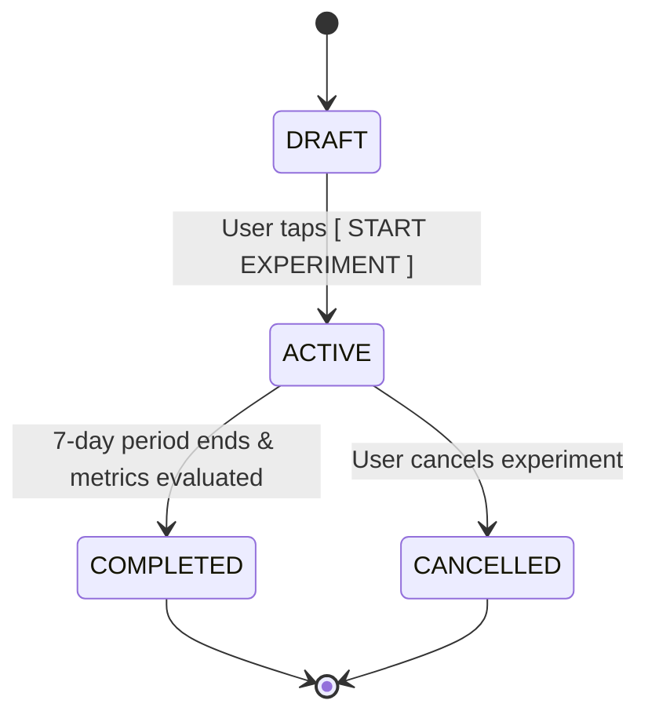

# Phase 4C-3: Behaviour Experiments Framework

## 1. Objective & Principle
The Behaviour Experiments framework allows users to test intentional behavioral changes (e.g., trying a new intervention or setting a stricter evening window) over a structured 7-day period.

---

## 2. Invariants & Safety Guarantees
- **No Automatic Plan Mutation**: Experiments are never automatically applied.
- **Explicit User Initiation**: The user explicitly taps `[ START EXPERIMENT ]`.
- **Reversibility**: An active experiment can be cancelled at any time by the user.
- **Parent Mode Authoritative Precedence**: Experiments running in Self Mode cannot override or weaken Parent Mode policies.
- **Local Persistence**: Stored on-device in `behaviour_experiments` via Room.

---

## 3. Experiment Lifecycle

### Pre-Populated Experiment Catalog
1. **"Protect Instagram After 9 PM"**: Focuses on evening friction reduction.
2. **"Use Box Breathing for 7 Days"**: Evaluates mindful breathing vs physical movement.
3. **"Reduce Earned Time to 5 Minutes"**: Tests shorter reward sessions to prevent binge browsing.
