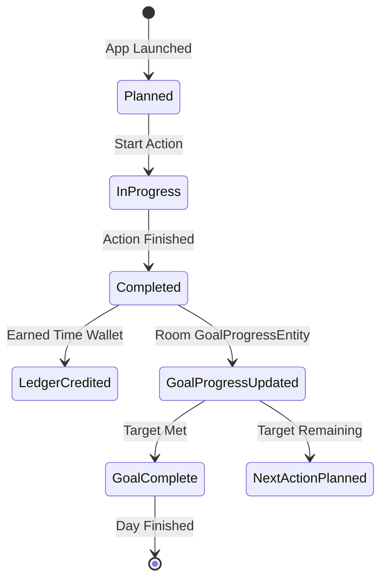

# Phase 4D-2: Progress & Goal Integrity Model

## 1. Progress State Lifecycle

---

## 2. Integrity Guarantees
- **Target Capping**: `completionPercentage` is clamped to $100\%$, preventing arithmetic overflows.
- **Idempotency**: Action transactions utilize unique UUID idempotency keys preventing double-crediting.
- **No Over-Earning**: When today's goal is complete, no additional reward-producing daily actions are suggested.
